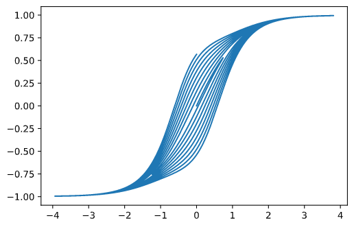

# !!! Major Changes Ahead !!!
HYSTERESIS has a lot of things going on in the background that I would love to explore, but the risk is making a massively complicated 
user interface, instead, it will be split up into multiple other plugins:
- HYSTERESIS: will only encompass the tape distortion and equalization aspects, so it can be used efficiently as a mastering plugin
- ???: will be a vibey tape artifact machine, doing wow, flutter, scrape flutter and dropouts, mostly for chorus
- ???: will be some plugin unrelated to tape emulation, which just implements stochastic quantization and some other chaotic shenanigans.

# Hysteresis v0.2.0

## <strong>Update Notice</strong>
Version v0.2.0 is incompatible with v0.1.0! Presets cannot be ported. Make sure to
backup any old instances of v0.1.0 if you don't want your projects to break.

A full changelist is at the bottom of this document.

## Installation
_**Disclaimer:** this plugin will only work on 64-bit windows machines!_ \
Download the `.dll` file in the `bin/` directory and place it into your DAW's VST folder.

## Compiling The Source Code
_**Note:** you don't need to compile the source code if you just want to use the plugin, just download the `.dll`._ \
Make sure you have Cargo installed on your computer (the Rust compiler). Then in the root of the repository run `cargo build`. Once Cargo is done building, there should be a `HYSTERESIS.dll` file in the newly created `debug/` directory. Place this file into your DAW's VST folder.

# What is Hysteresis?

Hysteresis is a tape emulation plugin that models the physical characteristics of ferro-magnetic tape. At its core is a standard hyperbolic tangent saturator, but on top of that it has a few nifty features.

The signal entering the saturator is first integrated with a "hysteresis" function, that emulates the effect of magnetic inertia in the tape. This in practice means that the rising and falling edges of a wave passing through the wave-shaper will be shaped differently, forming a sort of time-asymmetry (notice that this does not create even harmonics, because even harmonics come from phase-asymmetry, not time-asymmetry).

The plugin models also the tape hiss, not only by adding a shaped noise floor, but also by emulating the quantum phenomena that make this hiss arise in the real thing. (if you hate hiss, you can turn this off). The phenomena behind this is "stochastic quantization". Essentially the way the tape is magnetized is not in a continuous fashion but through a stepped function with discrete (yet randomly spaced) steps (quanta).

Additionally, some effects are included that emulate the sound of a more degraded tape. Wow and flutter are available, as well as a parameter called "erase" which emulates the "self-erasure" effect of a tape which was last recorded to a long time ago, and thus the high frequency information has been deleted by its own magnetic field feeding back on itself.

 \
This is an example of what the saturation and hysteresis transfer function might look like in any given moment. Notice that the curve in the middle splits up, this is what the hysteresis does. When the wave is going up, the lower edge of the curve is followed, whereas when the wave is going down, the upper edge is followed.
# Controls Explained

- Pre-gain: gain applied before distortion, useful to drive the saturator.
- Bias: constant DC added before the distortion, creates even harmonics. Bipolar control.
- Hysteresis: time-asymmetry of the saturation curve, essentially allows only larger
changes in signal to be written to tape, essentially behaving as a hybrid between
a heavily non-linear high-pass filter and a crossover distortion.
- Sat. mode: saturation model. Based on the magnetization curves of various metals
as well as an additional "soft saturation".
- Drive: amount of saturation. This control is slightly different than the pre-gain
control. The pre-gain is applied before any processing, whereas drive is applied
after hysteresis and quantum.
- Quantum: amount of stochastic quantization, adds correlated noise floor. Interacts in interesting ways with the saturation (higher values of saturation and quantum create glitchy rumbles in the sub range). High values sound like bit-depth reduction. At 0 the effect is off.
- Wow: emulation of the "wow" effect of a malfunctioning tape machine.
- Flutter: emulation of the "flutter" effect of a malfunctioning tape machine.
- Erase: self-erasure of the tape. Essentially applies saturation to the higher
frequencies, making them quieter and more compressed. This essentially works as
a heavily non-linear low-pass filter and creates very realistic worn tones.
- Hiss: adds a constant noise floor between all stages of the effect, while this
is in essence just white noise (actually blue noise) because it is added in small
amounts between every stage of the effect, the various layers of distortion shape
and mangle the noise, making it merge into the input signal in a very believable
way.
- Dry / wet: mix between the dry and wet signal. Combining this with wow and flutter
creates interesting flanging or chorus effects.
- Post-gain: gain applied after all the effects, used to tame hard-driven saturation. Try boosting the pre-gain and reducing the post-gain to obtain higher harmonics without considerably changing the perceived loudness.

# Changelist
The vast majority of the plugin was re-designed.
- Added: new saturation modes
- Added: Wow and flutter
- Added: Self-erasure effect, emulates old tape where the high frequencies have faded.
- Added: Hiss, introduces multiple layers of correlated and non-correlated noise.
- Added: Dry / wet. Allows flanging and chorus effects.
- Modified: Hysteresis algorithm war reworked and simplified
- Modified: Pre and post-gain faders have been re-scaled and are now showing their values in decibels.
- Removed: post-EQ, now a similar effect can be obtained with erase.
- Removed: hysteresis width. The new hysteresis algorithm does not support this.
