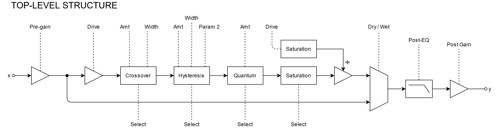
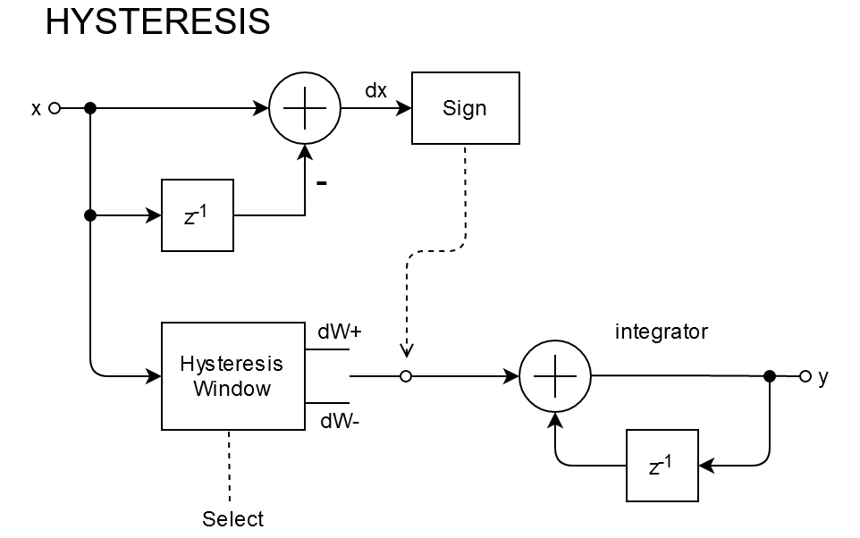
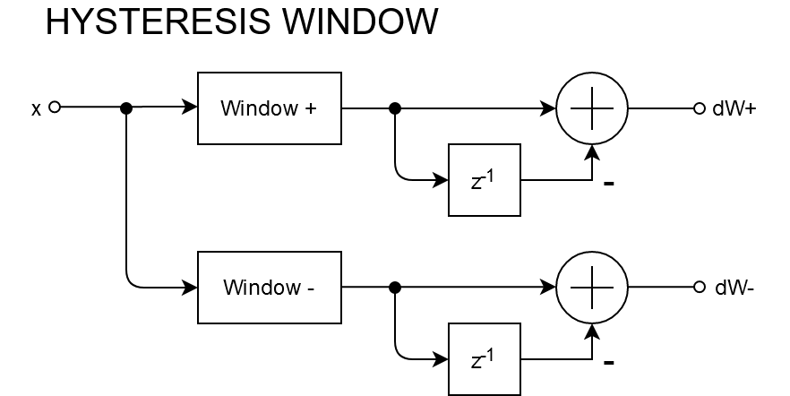

# Technical Specification

## Structure
What follows are DSP diagrams describing some of the plugin's architecture.

In the overall structure above, what is notable is that the drive input is passed in parallel through the selected saturation algorithm and then the output audio from the saturation is divided by this saturated control signal, this makes the drive knob leave peaks at unity gain unaffected, making the plugin more practical by removing the need to dial down post-gain in some cases.

The hysteresis function above works by replacing the differential of the input with a modified differential and then integrating this differential. The modified differential changes based on the polarity of the original differential.

The hysteresis window functions above are usre-selectable.
